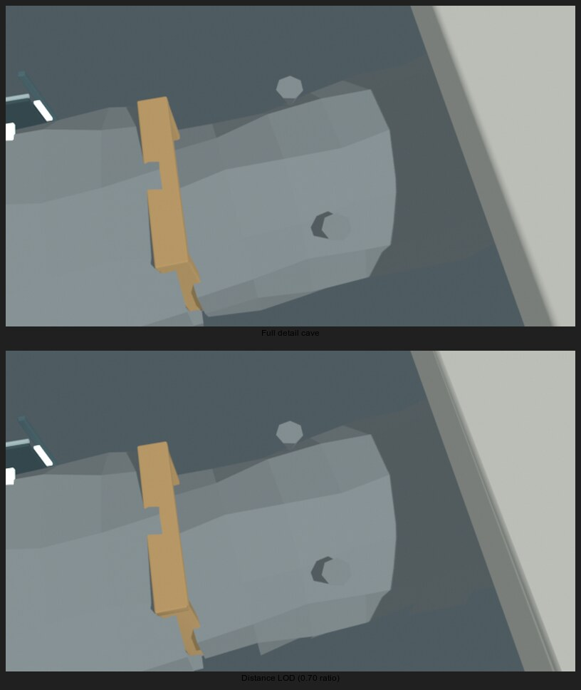

# Reusable world-object levels of detail

Status: signed contract, runtime switching, and complementary screen-door
transitions implemented; the portable island village, static moored lobster
boat, and UNDERNEATH cave have authored lower-detail variants. Matched-view
visual validation remains outstanding.
Avatar distance LOD is implemented separately in `RemoteAvatar.js`.

## Existing renderer paths

Terrain uses CDLOD geomorphing. Procedural vegetation uses geometry levels and
impostors with dither transition bands; scanned debris, fish and reef also have
authored levels. Keep these paths and their close-range appearance.
`WorldPackage.js` currently clones one full GLB for each signed asset instance;
visibility-prioritized loading in `WorldStreaming.js` does not reduce its mesh.

## Content and streaming contract

An asset instance may declare optional signed `lods`, ordered from medium to
lowest detail, each referencing a distinct content-addressed GLB and a decreasing
`maxScreenFraction` threshold. Keep the existing `assetId` as full detail and the
collision source. Validate bounded level counts, threshold ordering, referenced
GLB types, and compatible bounds/transforms in source import, server manifests,
client verification and AI/Blender authoring. Geometry alternatives must retain
materials, UVs and silhouettes; do not drop arbitrary runtime triangles.

Separate variant assets let distant and portal views acquire small meshes first.
They also allow neighbors to cache each variant with the existing owner-scoped
permissions. Geometry variants must not change collision or gameplay authority.
A persistent instance wrapper owns its world transform; visual children may be
replaced without moving the object or rebuilding collision. Keep a usable level
while asynchronously loading its replacement; abort and reject stale loads on
handoff. Use hysteresis and transition rendering to avoid oscillation and popping.

## Camera selection

Select by projected bounds and actual view resolution, with a sustained-load
bias that recovers when rendering headroom returns. Preserve full close-range
Flip7 quality with sufficient headroom. Explicitly update before scene traversal.
`MeshRenderer.onBeforeRender` is invoked only on eligible visible meshes, so a
hidden child cannot use it to reactivate itself and groups cannot select levels
there. Portal previews must use `WorldPortalView`'s mapped destination camera and
256 by 512 target, rather than the main camera or player position.

## Verification gates

Check near/far/near selection, hysteresis, actual submitted triangle reductions,
unchanged materials/transforms/collisions, mapped portal-camera selection,
variant fetch priority, shared-resource disposal and interrupted downloads.
Compare matching near and distant views locally and on Flip7, including animated
avatars. Structural GLB checks alone are insufficient visual evidence.

## Implemented contract and runtime

`lods` contains one to three records with exactly `assetId` and
`maxScreenFraction` fields. Thresholds are finite, strictly decreasing and
between zero and one; variant IDs are distinct from each other and the base.
Streaming bounds are required. Source import and signed client/server manifest
validation enforce the contract and GLB references. The converter hashes every
variant. Proposal and Blender action updates permit validated LOD declarations.

`WorldObjectLOD` estimates the projected sphere diameter relative to viewport
height using transformed bounds and the camera projection matrix. It switches
with 12% hysteresis. Each package owns per-object controllers and persistent
instance wrappers; visual levels are independently cached under verified hashes.
Selected variants load on demand through `WorldConnector.getAsset`, keeping the
current visual until acquisition completes. Completion cannot change visibility;
the next explicit per-camera update starts a 200 ms screen-door cross-fade.
Incoming and outgoing GLB materials receive per-instance fade uniforms, including
alpha-tested color and shadow passes. If the camera reverses during a blend, the
same two levels reverse their fade without a pop; additional target changes wait
for the active blend to finish. Disposal aborts variant downloads.
Heightfield collision always traverses the base visual, even if a lower level is
currently displayed. Other collision descriptors remain unchanged.

Current limits: the base mesh is still initially acquired; loaded levels are
retained until package disposal, so LOD reduces draw geometry but does not yet
reduce texture/mesh residency. Selection uses screen fraction rather than a fixed target
pixel size. RenderLoadLOD supplies a bounded sustained-load bias: two seconds
above 110% of the frame-work budget increases it one level, and six seconds
below 75% restores one level. Half-second smoothing and a neutral band avoid
flapping; elapsed sampling is capped to ignore suspended-tab gaps. Intentional
frame pacing is excluded from render work. The object selector divides screen
fraction by up to four under maximum bias, but preserves the ordinary authored
selection for objects occupying at least 25% of viewport height. Avatar distance thresholds
shift gradually outside eight meters; nearby avatars always retain full detail.
Each main or mapped portal camera selects against its own distance/projection;
async downloads never switch visuals outside that explicit camera update. Object
variants use hysteresis and complementary screen-door dither cross-fades. The hosted island village declares
one lower-detail level at a 0.45 viewport-height threshold. Its checked-in GLB is
generated from the full-detail village GLB with
`tools/blender/export-world-object-lod.py` under Blender 4.3.2; the export tool
checks that all trusted village material roles, vertex tint and `_TW_VDATA`
survive. It reduces this object from 137,888 to 48,260 triangles (65%) and from
14.3 MB to 7.5 MB. The base GLB remains the collision source and full-detail
visual. The moored lobster boat's portal-preview GLB also declares one lower-
detail level at the same projected-size threshold. Its Blender 4.3.2 variant
preserves all 12 material assignments, vertex colors and UVs, reducing it from
46,845 to 16,395 triangles (65%) and from 2.55 MB to 1.26 MB. The base GLB
remains the close-view source. The UNDERNEATH cave scene declares one lower-
detail level at the same threshold. Its Blender 4.3.2 variant reduces the
scene from 13,248 to 9,198 triangles (31%) and from 736,336 to 655,876 bytes.
The cave packager restores material definitions by name from the full-detail
GLB after Blender export, preserving its authored emissive strength and
per-object color. A more aggressive 0.35 ratio visibly broke up cave surfaces
in the station view, so it was rejected. The checked-in 0.70-ratio result was
visually compared against the full mesh from the same 640 by 360 Blender
camera at `(-230, 7, 30)` looking toward `(-220, 5, 8)`; its station-view SSIM
was 0.9905. This is an offline geometry check, not browser or Flip7 validation.
The comparison is included below. The full cave GLB remains the collision and
close-view source. The 141 scanned debris placements across four source models
now use the source GLBs' authored third mesh as their shared far LOD. It reduces
each model from 700 to 160 triangles, 500 to 119, 500 to 119, and 299 to 80,
while retaining the exact same embedded albedo bytes, UV channel, and normals.
The base and far-level bounds are combined for screen-size selection. Near/far image comparisons and the Flip7 check
remain open; mesh structure and the runtime selector alone do not prove
distant visual quality.



To regenerate the checked-in village level, export the full package to a
temporary directory and use its full-detail village GLB as the Blender input:

```sh
npm run export:island -- --out /var/tmp/elsemesh-island-full
blender --background --python tools/blender/export-world-object-lod.py -- \
  --source /var/tmp/elsemesh-island-full/assets/<village-asset-sha256> \
  --out worlds/island/lod-source/village-low.glb --ratio 0.35
npm run export:island
```

Regenerate the boat preview variant the same way, using its content-addressed
full-detail GLB from the temporary export and writing to
`worlds/island/lod-source/moored-boat-low.glb` with `--ratio 0.35`.

Regenerate the UNDERNEATH cave variant from a clean package export using
`--ratio 0.70`, write the Blender result to
`/var/tmp/underneath-cave-low.glb`, then copy that file to
`worlds/loz-underneath/lod-source/cave-low.glb` and run
`node tools/export-loz-underneath.mjs`. The cave exporter maps the reduced
primitives to the original material definitions by material name; do not
publish a Blender GLB directly as the packaged cave LOD because Blender can
change the authored emissive strengths.

The checked-in low-detail GLB is a stable export input. Package export hashes it
into the signed content-addressed asset directory, so repeated exports do not
need Blender and retain deterministic world-source and asset IDs.

`test/world-object-lod.mjs` uses texture-free GLBs to establish small-level
selection and transitions, and loads the checked-in boat base and reduced GLBs
to verify asset-local bounds, far-level selection, and compatible material and
geometry installation. With `ELSEMESH_WORLD_OBJECT_LOD_RENDER=1`, headless WebGPU
renders both actual boat levels through color and shadow passes as well as the
masked synthetic transition fixture. These checks do not establish matched
near/far image fidelity. Contract tests
exercise invalid declarations and CLI hash import; Go tests cover signed validation.
To compile and render the packaged-object fade shaders through headless WebGPU,
run `ELSEMESH_WORLD_OBJECT_LOD_RENDER=1 node test/world-object-lod.mjs` from the
external build tree after copying source into it. This checks masked material
pipelines for both visible levels in color and shadow passes; it does not replace
matched-view or Flip7 visual checks.
